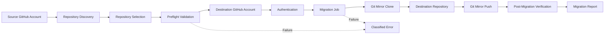
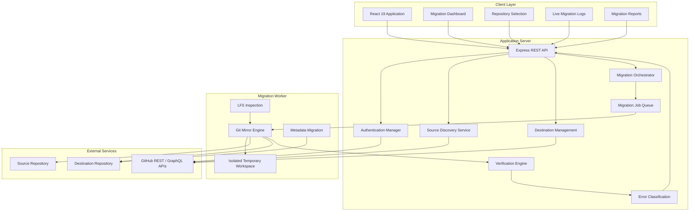
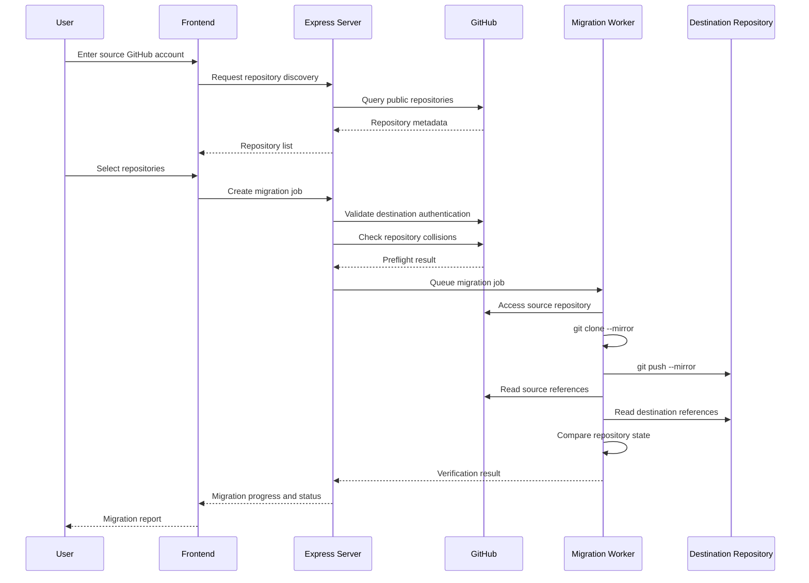
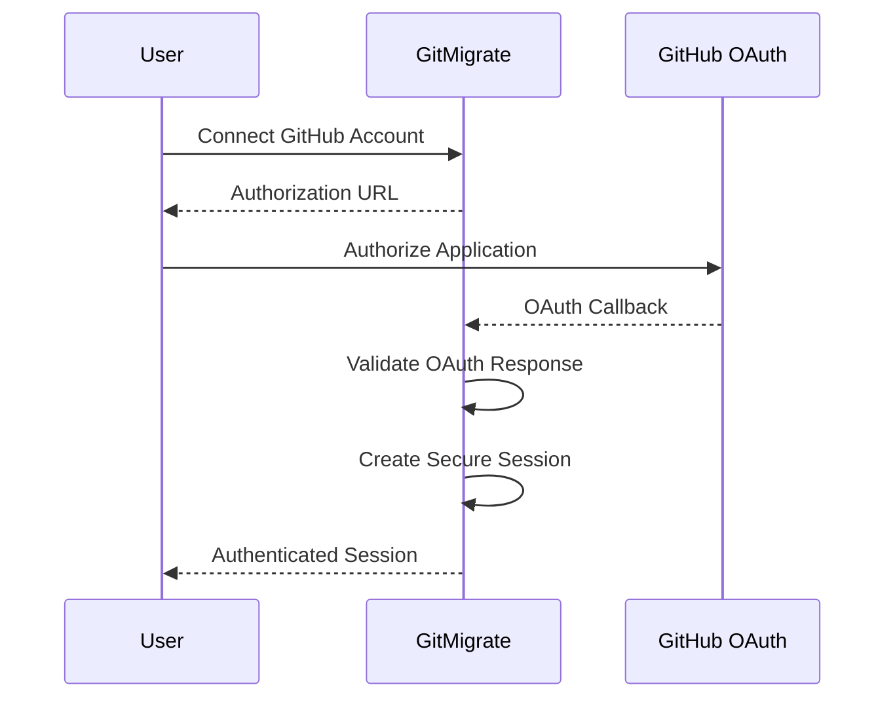
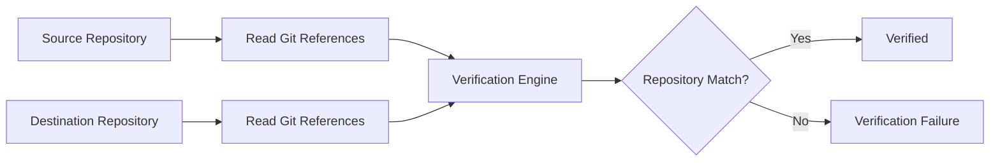
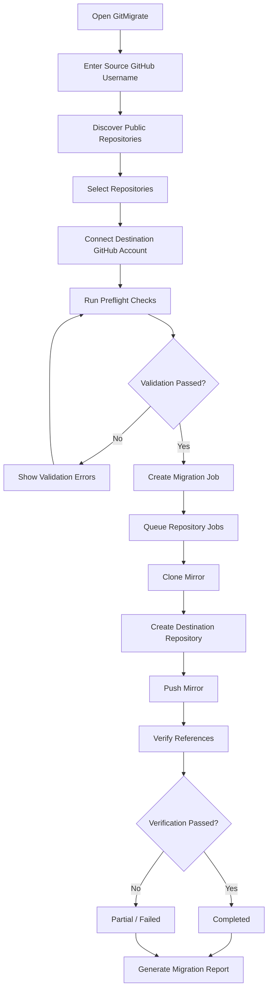
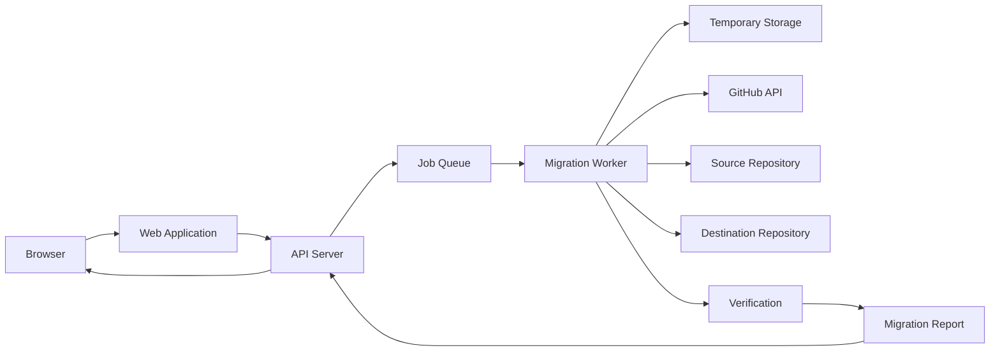

# GitMigrate

## GitHub Public Repository Migration Platform

GitMigrate is a full-stack repository migration platform designed to transfer public GitHub repositories from one GitHub account to another while preserving Git history and repository structure.

The platform provides repository discovery, destination authentication, preflight validation, migration job management, Git mirror operations, progress tracking, post-migration verification, classified error reporting, and security-focused credential handling.

GitMigrate is designed for developers who need a controlled and transparent way to move public repositories between GitHub accounts without manually cloning and recreating repositories one by one.

---

## Overview

Migrating repositories manually can involve multiple repetitive steps:

1. Discovering repositories belonging to the source account.
2. Selecting repositories for migration.
3. Authenticating the destination GitHub account.
4. Creating destination repositories.
5. Cloning repository history.
6. Pushing branches and tags.
7. Verifying that the destination matches the source.
8. Handling failures and retrying incomplete migrations.

GitMigrate brings these operations into a single workflow.

The migration engine uses Git mirror operations to preserve the underlying Git repository structure, including commit history, branches, tags, commit metadata, and Git object relationships.



---

## Key Capabilities

### Repository Discovery

GitMigrate can discover public repositories associated with a GitHub username.

The discovery process handles:

* Public repository enumeration
* API pagination
* Repository metadata
* Default branches
* Repository size
* Topics
* Language information
* Issue availability
* Wiki availability
* Fork filtering
* Inaccessible repository filtering
* GitHub API rate-limit handling

---

### True Git Mirror Migration

GitMigrate uses Git mirror operations to migrate repository Git data.

The core workflow is conceptually equivalent to:

```bash
git clone --mirror SOURCE_REPOSITORY
git push --mirror DESTINATION_REPOSITORY
```

This approach is designed to preserve:

* Commit SHAs
* Complete commit history
* Branch references
* Annotated tags
* Lightweight tags
* Commit messages
* Author information
* Committer information
* Historical timestamps
* Git object relationships
* Repository commit trees

GitHub's own migration documentation also describes migration workflows that preserve Git repository data through migration tooling.

---

## Migration Architecture



---

## System Data Flow

The complete migration process follows a controlled sequence.



---

# Migration Lifecycle

GitMigrate uses explicit migration states to make the progress of each operation observable.

## Job States

```text
CREATED
   |
   v
PREFLIGHT
   |
   v
QUEUED
   |
   v
RUNNING
   |
   +------> PAUSED
   |          |
   |          v
   |        RUNNING
   |
   v
VERIFYING
   |
   +------> PARTIAL
   |
   +------> FAILED
   |
   v
COMPLETED
```

Supported job states include:

| State       | Description                                                              |
| ----------- | ------------------------------------------------------------------------ |
| `CREATED`   | Migration request has been created                                       |
| `PREFLIGHT` | Environment and repository validation is running                         |
| `QUEUED`    | Migration is waiting for worker execution                                |
| `RUNNING`   | Repository migration is actively running                                 |
| `PAUSED`    | Migration has been temporarily paused                                    |
| `VERIFYING` | Source and destination repositories are being compared                   |
| `COMPLETED` | Migration completed successfully                                         |
| `PARTIAL`   | Some repositories or migration components completed while others did not |
| `FAILED`    | Migration failed                                                         |
| `CANCELLED` | Migration was cancelled                                                  |

---

# Repository Migration States

Individual repositories have their own lifecycle.

```text
DISCOVERED
    |
    v
SELECTED
    |
    v
ANALYZING
    |
    v
DESTINATION_CREATED
    |
    v
CLONING
    |
    v
PUSHING
    |
    v
VERIFYING
    |
    v
METADATA_MIGRATION
    |
    v
COMPLETED
```

Possible repository states include:

```text
DISCOVERED
SELECTED
ANALYZING
DESTINATION_CREATED
CLONING
PUSHING
VERIFYING
METADATA_MIGRATION
COMPLETED
PARTIAL
FAILED
SKIPPED
```

---

# Preflight Validation

Before a migration begins, GitMigrate performs validation to detect problems before the migration worker starts.

Typical checks include:

### Source Validation

* GitHub username format
* Public repository accessibility
* Repository availability
* API response validity
* Repository filtering

### Destination Validation

* Destination authentication
* Repository name availability
* Repository collision detection
* Destination permissions

### Worker Validation

* Git installation
* Git binary availability
* Git version
* Temporary storage availability
* Required environment variables
* Worker runtime configuration

This prevents avoidable failures such as attempting to start a migration when the worker cannot execute Git.

---

# Git Environment Detection

GitMigrate supports configurable Git executable discovery.

The migration worker can use:

```text
GIT_PATH
```

when a Git binary is not available through the normal system `PATH`.

Example:

```env
GIT_PATH=/usr/bin/git
```

Windows example:

```env
GIT_PATH=C:\Program Files\Git\cmd\git.exe
```

Linux containers must have Git installed inside the worker container. Installing Git only on the host does not make the binary available inside an isolated container.

---

# Supported Worker Environments

GitMigrate is designed to support environments where the migration worker can execute Git commands and access temporary storage.

### Linux

Typical Git locations:

```text
/usr/bin/git
/usr/local/bin/git
```

### Windows

Typical installation:

```text
C:\Program Files\Git\cmd\git.exe
```

### Docker

Git must be installed inside the worker image.

Example:

```dockerfile
RUN apt-get update && \
    apt-get install -y git
```

### Dedicated Worker

Long-running migrations should use a worker environment capable of:

* Running Git processes
* Maintaining temporary files
* Handling large repositories
* Maintaining network connections
* Executing asynchronous jobs
* Cleaning migration workspaces

---

# Authentication

GitMigrate supports destination GitHub authentication through OAuth and Personal Access Tokens.

## GitHub OAuth

The application can initiate GitHub OAuth authorization and establish a destination session.



Authentication credentials are intended to remain server-side and should not be exposed to the browser or migration logs.

---

## Personal Access Token

GitMigrate can also accept a GitHub Personal Access Token when OAuth configuration is unavailable.

The token should be supplied through a secure channel and must never be committed to source control.

Example environment configuration:

```env
GITHUB_CLIENT_ID=your_client_id
GITHUB_CLIENT_SECRET=your_client_secret
```

Never place real credentials inside:

```text
README.md
.env committed to Git
source code
client-side JavaScript
logs
error messages
screenshots
```

---

# Security

Security is a core part of the migration workflow.

GitMigrate includes mechanisms for reducing accidental credential exposure and protecting migration sessions.

## Credential Redaction

Sensitive values should be removed from:

* Application logs
* Git process output
* Standard output
* Standard error
* Exceptions
* Migration reports
* Debug information

Potential secrets include:

```text
GitHub Personal Access Tokens
OAuth access tokens
Authorization headers
Repository credentials
Session secrets
```

---

## Temporary Workspace Isolation

Migration repositories are stored in isolated temporary directories.

The architecture uses a structure similar to:

```text
/tmp/github-migrations/
└── {jobId}/
    ├── {repositoryId-1}/
    │   └── mirror.git/
    │
    ├── {repositoryId-2}/
    │   └── mirror.git/
    │
    └── {repositoryId-3}/
        └── mirror.git/
```

Temporary migration data should be removed after the migration and verification process finishes.

---

# Migration Verification

GitMigrate does not simply assume that a successful Git push means the migration is complete.

The verification layer compares source and destination repository references.

The verification process can inspect:

* HEAD
* Branch references
* Tag references
* Commit SHAs
* Commit counts
* Repository accessibility

Conceptually:



This provides an additional integrity check after the migration operation.

---

# Error Classification

Migration failures can occur for many different reasons.

Instead of presenting only raw Git errors, GitMigrate classifies failures into application-level categories.

Examples include:

```text
GIT_NOT_FOUND
GIT_AUTH_FAILED
GIT_NETWORK_ERROR
GIT_DISK_SPACE_ERROR
GIT_CLONE_FAILED
GIT_PUSH_FAILED
GIT_VERIFICATION_FAILED
DESTINATION_EXISTS
SOURCE_NOT_ACCESSIBLE
INVALID_REPOSITORY
MIGRATION_CANCELLED
UNKNOWN_ERROR
```

A classified error can provide:

```text
Error Code
Human-readable Message
Technical Details
Repository
Migration Job
Recommended Action
```

This makes troubleshooting significantly easier than relying exclusively on raw process output.

---

# API

GitMigrate exposes a REST API for repository discovery, authentication, migration management, and reporting.

## Source Discovery

```http
POST /api/source/discover
```

Example request:

```json
{
  "url": "https://github.com/username"
}
```

Example response:

```json
{
  "user": {
    "login": "username",
    "avatar_url": "https://..."
  },
  "repositories": [],
  "count": 27
}
```

---

## Authentication

### Get GitHub OAuth URL

```http
GET /api/auth/github/url
```

### OAuth Callback

```http
GET /auth/callback
```

### Connect Using PAT

```http
POST /api/auth/token
```

Example:

```json
{
  "token": "YOUR_GITHUB_TOKEN"
}
```

### Check Session

```http
GET /api/auth/session
```

### Logout

```http
POST /api/auth/logout
```

---

# Destination Repository Validation

```http
POST /api/destination/check-repo
```

Example:

```json
{
  "repoName": "GameHub"
}
```

Example response:

```json
{
  "exists": false,
  "available": true,
  "fullName": "newuser/GameHub"
}
```

---

# Migration API

## Create Migration

```http
POST /api/migrations
```

Example:

```json
{
  "sourceUsername": "olduser",
  "repositories": [
    {
      "sourceName": "GameHub",
      "destinationName": "GameHub",
      "visibility": "public",
      "migrateIssues": true,
      "migrateReleases": true,
      "migrateWiki": true
    }
  ]
}
```

Response:

```json
{
  "jobId": "uuid-...",
  "status": "QUEUED"
}
```

---

## List Migrations

```http
GET /api/migrations
```

---

## Migration Details

```http
GET /api/migrations/:id
```

Provides:

* Migration status
* Repository status
* Progress
* Active logs
* Error information
* Verification information

---

## Pause Migration

```http
POST /api/migrations/:id/pause
```

## Resume Migration

```http
POST /api/migrations/:id/resume
```

## Retry Migration

```http
POST /api/migrations/:id/retry
```

## Cancel Migration

```http
POST /api/migrations/:id/cancel
```

## Migration Report

```http
GET /api/migrations/:id/report
```

The report can contain migration results and verification information.

---

# Technology Stack

## Frontend

| Technology   | Purpose                        |
| ------------ | ------------------------------ |
| React 19     | User interface                 |
| Vite         | Frontend development and build |
| Tailwind CSS | UI styling                     |
| Lucide React | Interface icons                |
| Motion       | UI animations                  |

## Backend

| Technology    | Purpose                   |
| ------------- | ------------------------- |
| Node.js       | Runtime                   |
| TypeScript    | Application language      |
| Express       | REST API                  |
| TSX           | TypeScript execution      |
| dotenv        | Environment configuration |
| cookie-parser | Cookie/session handling   |

## Migration Engine

| Technology     | Purpose                |
| -------------- | ---------------------- |
| Git            | Repository migration   |
| Git mirror     | Full Git data transfer |
| isomorphic-git | Git functionality      |
| Dugite         | Git process support    |

## Build Tooling

| Technology | Purpose               |
| ---------- | --------------------- |
| Vite       | Frontend build        |
| esbuild    | Server bundling       |
| TypeScript | Type checking         |
| npm        | Dependency management |

The current project dependencies and scripts are defined in `package.json`.

---

# Project Structure

The repository is organized into separate frontend, backend, test, documentation, and deployment areas.

```text
GitMigrate/
│
├── public/
│   └── assets/
│       └── aistudio/
│
├── server/
│   └── ...
│
├── src/
│   └── ...
│
├── tests/
│   └── ...
│
├── .env.example
├── .gitignore
│
├── API.md
├── ARCHITECTURE.md
├── DEPLOYMENT.md
├── MIGRATION.md
├── README.md
├── SECURITY.md
├── TROUBLESHOOTING.md
│
├── index.html
├── metadata.json
├── package.json
├── server.ts
├── tsconfig.json
└── vite.config.ts
```

---

# Installation

## Prerequisites

Before running GitMigrate locally, install:

* Node.js
* npm
* Git
* A GitHub account
* GitHub OAuth application credentials if OAuth authentication is required

Verify Node.js:

```bash
node --version
```

Verify npm:

```bash
npm --version
```

Verify Git:

```bash
git --version
```

---

# Clone the Repository

```bash
git clone https://github.com/mzainulabideendev/GitMigrate.git
```

Enter the project directory:

```bash
cd GitMigrate
```

Install dependencies:

```bash
npm install
```

---

# Environment Configuration

Create an environment file:

```bash
cp .env.example .env
```

Configure the required values according to your deployment environment.

Example:

```env
PORT=3000

GITHUB_CLIENT_ID=your_client_id
GITHUB_CLIENT_SECRET=your_client_secret

GIT_PATH=/usr/bin/git
```

Do not commit `.env` files containing real secrets.

---

# Development

Start the development server:

```bash
npm run dev
```

The application server runs through the project's TypeScript server entry point.

---

# Type Checking

Run TypeScript validation:

```bash
npm run lint
```

---

# Production Build

Create a production build:

```bash
npm run build
```

Start the production server:

```bash
npm start
```

Preview the Vite production output:

```bash
npm run preview
```

---

# Testing

Run the migration service test suite:

```bash
npx tsx tests/gitMigrationService.test.ts
```

Tests should cover critical areas including:

* Git availability
* Git path discovery
* Repository migration
* Error classification
* Credential redaction
* Verification
* Migration state transitions

---

# Example Migration Workflow

A typical user workflow is:



---

# Why Git Mirror Migration?

A normal clone usually focuses on obtaining a working copy of a repository.

A mirror clone is intended to reproduce the repository's complete Git reference structure.

For example:

```bash
git clone --mirror https://github.com/source/project.git
```

followed by:

```bash
git push --mirror https://github.com/destination/project.git
```

This is particularly useful when the objective is to preserve repository-level Git history rather than simply copy the latest working files.

---

# Limitations

GitMigrate primarily focuses on repository Git data and supported GitHub metadata.

Depending on the migration configuration and GitHub API capabilities, certain GitHub-specific features may require additional handling.

Potential areas include:

* Issues
* Releases
* Wiki content
* Git LFS objects
* Repository settings
* Collaborators
* Branch protection rules
* Secrets
* Actions configuration
* Organization-level settings
* Webhooks
* External integrations

A Git mirror operation should not be interpreted as automatically migrating every GitHub platform feature.

GitHub's official migration APIs distinguish between Git data and additional repository metadata, so feature parity depends on the migration mechanism being used.

---

# Deployment Considerations

GitMigrate performs repository operations that may require significant:

* CPU
* Memory
* Disk space
* Network bandwidth
* Execution time

Large repositories can require substantial temporary storage.

For production deployments, use a worker environment capable of running Git processes for extended periods.

A recommended architecture is:



For long-running migrations, a dedicated worker or container is preferable to an execution environment that imposes short request timeouts.

---

# Operational Recommendations

For production deployments:

1. Install Git inside the migration worker environment.
2. Configure `GIT_PATH` when automatic discovery is insufficient.
3. Allocate sufficient temporary disk space.
4. Protect GitHub credentials.
5. Never expose access tokens to client-side logs.
6. Enable HTTPS.
7. Use secure session cookies.
8. Implement request validation.
9. Apply rate limiting where appropriate.
10. Clean temporary migration directories after completion.
11. Monitor worker resource consumption.
12. Keep detailed migration logs without exposing secrets.
13. Perform post-migration verification.
14. Provide retry functionality for recoverable failures.
15. Test migrations with non-critical repositories before production use.

---

# Troubleshooting

## Git Not Found

If the application reports that Git cannot be found:

```bash
git --version
```

If Git is installed but not detected, configure:

```env
GIT_PATH=/path/to/git
```

For Docker deployments, ensure Git is installed inside the container rather than only on the host.

---

## Authentication Failure

Verify:

* GitHub OAuth configuration
* GitHub application credentials
* PAT validity
* Required repository permissions
* Session configuration
* Token expiration

Never paste a production access token into an issue, public repository, or log.

---

## Destination Repository Already Exists

Run the destination preflight check before migration.

If the repository already exists, either:

* Select another destination name
* Remove the existing repository if appropriate
* Use an explicit migration strategy for the existing repository

Avoid destructive operations unless the user has explicitly confirmed them.

---

## Migration Verification Failure

If migration succeeds but verification fails, compare:

```text
HEAD
Branches
Tags
Commit SHAs
Reference counts
```

The verification result should be investigated before declaring the migration complete.

---

# Security Policy

Security issues should be handled privately rather than publicly disclosed through GitHub Issues.

Please review:

```text
SECURITY.md
```

for the project's security reporting process.

Do not submit:

* GitHub tokens
* OAuth secrets
* Session cookies
* Passwords
* Private repository credentials
* Environment files

to public issues or pull requests.

---

# Documentation

Additional project documentation is available in the repository:

| Document             | Purpose                                  |
| -------------------- | ---------------------------------------- |
| `ARCHITECTURE.md`    | System architecture and subsystem design |
| `API.md`             | REST API specification                   |
| `MIGRATION.md`       | Migration workflow and behavior          |
| `DEPLOYMENT.md`      | Deployment configuration                 |
| `SECURITY.md`        | Security policy                          |
| `TROUBLESHOOTING.md` | Common problems and solutions            |

---

# Project Status

GitMigrate is an actively developed migration platform.

Current implementation includes:

* Public repository discovery
* Destination authentication
* Repository collision checks
* Migration job management
* Git mirror migration
* Git environment detection
* Migration state tracking
* Error classification
* Credential redaction
* Post-migration verification
* Migration reporting
* REST API endpoints
* Automated migration tests

The repository currently contains frontend, server, testing, API, architecture, deployment, migration, security, and troubleshooting documentation.

---

# Roadmap

Potential future improvements include:

* Advanced migration scheduling
* Multi-worker migration processing
* Persistent job queues
* Improved Git LFS migration
* Expanded GitHub metadata migration
* Branch protection migration
* GitHub Actions migration
* Webhook migration
* Organization-to-organization migration
* Migration resume checkpoints
* Advanced progress streaming
* Larger repository optimization
* Distributed worker architecture
* Improved migration analytics
* Automated migration health monitoring

---

# Contributing

Contributions are welcome.

A typical contribution workflow is:

```bash
git clone https://github.com/mzainulabideendev/GitMigrate.git

cd GitMigrate

npm install

npm run lint

npm run build

npx tsx tests/gitMigrationService.test.ts
```

Create a feature branch:

```bash
git checkout -b feature/your-feature
```

Make your changes, test them, and submit a pull request with a clear explanation of the implementation.

---

# Development Principles

GitMigrate follows several important engineering principles:

### Integrity

Repository data should be migrated without unnecessarily modifying Git history.

### Security

Credentials and sensitive authentication data should never be exposed through logs or client-side code.

### Transparency

Users should be able to understand the current state of a migration.

### Verification

Successful Git operations should be followed by integrity verification.

### Recoverability

Recoverable failures should provide useful error information and retry mechanisms.

### Isolation

Temporary migration data should be isolated per migration job and cleaned after use.

---

# License

Add the project's selected open-source license here.

For example:

```text
MIT License
```

If this project is intended to remain proprietary, replace this section with the appropriate proprietary license notice.

---

# Repository

Source code:

https://github.com/mzainulabideendev/GitMigrate

Project:

**GitMigrate — GitHub Public Repository Migration Platform**

Built with React, TypeScript, Express, Vite, Git, and GitHub APIs.

---

## Acknowledgements

GitMigrate is built around standard Git repository operations and GitHub APIs.

The project uses Git mirror operations to provide high-fidelity Git repository migration and includes an application-level verification layer to validate the resulting repository state.

For GitHub's official migration capabilities and requirements, refer to the GitHub documentation.
